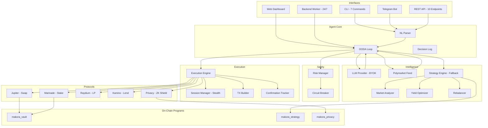

# Makora

**The First LLM-Powered Privacy-Preserving DeFi Agent on Solana**

[-8b5cf6?style=flat-square)](https://claude.ai)
[](https://solana.com)
[](https://en.wikipedia.org/wiki/Zero-knowledge_proof)
[](#llm-powered-intelligence)
[](LICENSE)

> All code in this repository was written by an AI agent (Claude) for the [Solana Agent Hackathon](https://colosseum.com/agent-hackathon). Every line of TypeScript, Rust, and Circom.

---

## What Makes Makora Different

Makora is not a trading bot. It's an **autonomous DeFi agent** that thinks with LLMs, reads prediction markets, and protects your privacy on Solana.

| Feature | Makora | Typical DeFi Bots |
|---------|--------|-------------------|
| Intelligence | **LLM-powered** (Anthropic/OpenAI/Qwen) + Polymarket signals | Simple rules |
| Trading Modes | **PERPS** (3s cycles, perpetuals) + **INVEST** (5min, DeFi yields) | Single mode |
| Auto Risk Controls | **Deterministic Auto-TP/SL** (no LLM needed) | Manual or none |
| On-chain programs | 3 Anchor programs | 0 (API-only) |
| Zero-knowledge privacy | Stealth addresses + shielded transfers | None |
| Decision framework | OODA loop with AI reasoning | If/else logic |
| Market intelligence | Polymarket prediction markets + DeFi yields | Price feeds only |
| Risk management | Circuit breaker + absolute VETO | Basic limits |
| Solana-native | 100% | Often EVM-first |
| Agent-to-Agent API | REST API for composability | None |
| NL interface | Parse natural language commands | Commands only |
| Interfaces | CLI + Dashboard + Telegram + REST API + Worker | Single interface |
| BYOK | Bring Your Own Key -- user's LLM API key, zero lock-in | N/A |
| Self-evaluation | Agent reviews own performance via LLM | None |
| Solana Blinks | Shareable Action URLs for swaps/strategy | None |
| Session reports | Exportable Markdown trading reports | None |
| Performance history | Persistent trade log with P&L charts | None |
| PWA | Installable on mobile devices | None |

---

## What It Does

```
You: "swap 10 SOL to USDC"

Makora:
  1. OBSERVE  - Fetches portfolio, prices, on-chain positions
  2. ORIENT   - LLM analyzes market data + Polymarket signals + yields
               → "Neutral sentiment, 65% confidence. SOL range-bound,
                  recommend 40% stake, 30% lend, 20% LP."
  3. DECIDE   - Strategy evaluation + risk manager validation (VETO power)
  4. ACT      - Executes on-chain via stealth session wallets

  Result: TX confirmed at slot 312,847,291
```

### Trading Modes

Makora operates in two distinct modes optimized for different strategies:

| Mode | Cycle Time | Focus | Risk Profile |
|------|------------|-------|--------------|
| **PERPS** | **3 seconds** | Perpetual futures (SOL-PERP, ETH-PERP, BTC-PERP) | Aggressive scalping |
| **INVEST** | 5 minutes | DeFi yields (stake, lend, LP) | Conservative growth |

#### PERPS Mode (Default)
- Ultra-fast perpetual futures trading on Jupiter Perps
- 2-5x leverage on SOL, ETH, BTC perpetuals
- **Deterministic Auto Take-Profit** at +2% (no LLM needed)
- **Deterministic Auto Stop-Loss** at -5% (no LLM needed)
- Real-time P&L tracking with live position charts
- Session P&L aggregation across all trades

#### INVEST Mode
- Slower DeFi yield optimization
- Stake SOL via Marinade, lend via Kamino, LP via Raydium
- LLM-powered allocation decisions
- Lower risk, compounding returns

### LLM-Powered Intelligence

Makora's ORIENT phase is powered by real LLM reasoning instead of hardcoded rules:

- **Bring Your Own Key (BYOK)** -- Anthropic (Claude), OpenAI (GPT), or Qwen
- **Polymarket Integration** -- Prediction market signals as forward-looking sentiment
- **Structured Analysis** -- LLM outputs JSON: sentiment, allocation, risk assessment, reasoning
- **Transparent Reasoning** -- Every decision shows the LLM's chain of thought in the dashboard
- **Graceful Fallback** -- If the LLM fails, the deterministic strategy engine takes over

### DeFi Operations
- **Swaps** via Jupiter (real aggregation across Raydium, Orca, Lifinity, Meteora, Phoenix)
- **Staking** via Marinade (SOL -> mSOL liquid staking, ~7.2% APY)
- **Lending** via Kamino (USDC/SOL lending vaults)
- **LP** via Raydium (concentrated and standard liquidity)
- **Privacy** via ZK proofs (stealth addresses + shielded transfers)

### Operating Modes
- **Advisory** -- Makora analyzes with LLM reasoning, you approve
- **Autonomous** -- Makora executes within risk limits (circuit breaker protected)

---

## Architecture

```
User's API Key (localStorage, never leaves browser)
        |
Dashboard (Vercel) --POST /api/llm/analyze--> LLM Provider (Anthropic/OpenAI/Qwen)
        |                                              |
        v                                              v
  useOODALoop                                   Structured LLMAnalysis
  +----------+                                  +-------------------+
  | OBSERVE  |<-- on-chain portfolio            | sentiment         |
  | ORIENT   |<-- yields + Polymarket + LLM --> | allocation[]      |
  | DECIDE   |<-- risk manager validation       | risk assessment   |
  | ACT      |--> stealth session execution     | reasoning chain   |
  +----------+                                  +-------------------+
        |
  Backend Worker (Railway) -- same OODA loop, runs 24/7
```



### The OODA Loop (The Wheel)

```
     +===========+
     |  OBSERVE  |  Fetch portfolio, prices, yields, open positions
     +===========+
     |  ORIENT   |  LLM analysis + Polymarket signals + strategy engine
     +===========+
     |  DECIDE   |  Risk validation (5 checks, VETO power)
     +===========+
     |    ACT    |  Execute trades + Auto-TP/SL (deterministic)
     +===========+
         ~ PERPS: every 3 seconds | INVEST: every 60 seconds
```

---

## Quick Start

```bash
# Prerequisites: Node.js 20+, pnpm 8+

# Clone
git clone https://github.com/IsSlashy/Makora.git
cd Makora

# Install
pnpm install

# Build all packages
pnpm build

# Start dashboard (the primary interface)
cd apps/dashboard && pnpm dev
# Open http://localhost:3000
# Click gear icon -> configure your LLM API key -> watch the agent think

# Set up wallet (if you don't have one)
solana-keygen new

# Run CLI
cd apps/cli && node dist/index.js status

# Start headless worker (24/7 agent)
LLM_PROVIDER=anthropic LLM_API_KEY=sk-... LLM_MODEL=claude-sonnet-4-20250514 \
  node apps/worker/dist/index.js
```

### Environment Variables

```bash
# .env file
SOLANA_NETWORK=devnet
SOLANA_RPC_URL=https://api.devnet.solana.com
HELIUS_API_KEY=your_helius_key          # Optional: faster RPC
WALLET_PATH=~/.config/solana/id.json
TELEGRAM_BOT_TOKEN=your_telegram_token  # For Telegram bot
PORT=8080                               # For API server

# LLM config (for worker -- dashboard uses BYOK via Settings panel)
LLM_PROVIDER=anthropic                  # anthropic | openai | qwen
LLM_API_KEY=your_llm_api_key
LLM_MODEL=claude-sonnet-4-20250514
```

---

## Dashboard

The dashboard is the primary interface for judges. Features:

- **TheWheel** -- OODA loop phase visualization with kanji symbols
- **Trading Mode Selector** -- Toggle between PERPS (3s) and INVEST (5min) modes
- **Portfolio Card** -- Real-time portfolio value from connected wallet
- **Position Charts** -- Live SVG price curves with entry, TP, SL, liquidation levels
- **Session P&L** -- Aggregate profit/loss tracking across trading session
- **Execution Panel** -- Real-time trade execution log with timestamps
- **Chat Panel** -- Natural language interface with MoltBot trading persona
- **LLM Reasoning Panel** -- Live display of LLM analysis: sentiment, allocation, key factors, warnings
- **Polymarket Panel** -- Crypto prediction markets with probability bars, volume, 24h change
- **Strategy Panel** -- Active strategy with recommended allocation and blended APY
- **Activity Feed** -- Live log of agent actions with on-chain TX signatures
- **Risk Controls** -- Interactive sliders for position limits, slippage, circuit breakers
- **Settings Panel** -- BYOK: choose provider, enter API key, select model, test connection
- **Stealth Sessions** -- Privacy session status from on-chain vault state

### Position Visualization

In PERPS mode, each open position displays:
- **Dynamic SVG chart** with real-time price curve (updates every 2 seconds)
- **Entry price** (blue dashed line)
- **Take Profit level** (green) and **Stop Loss level** (red)
- **Liquidation price** (orange) with leverage-adjusted calculation
- **Unrealized P&L** with percentage and USD value
- **Pulsing current price indicator** at chart edge

### BYOK Settings (Bring Your Own Key)

Click the gear icon in the header to configure:

1. **Provider**: Anthropic (Claude) / OpenAI (GPT) / Qwen
2. **API Key**: Stored in localStorage only -- never touches our servers
3. **Model**: claude-sonnet-4-20250514, gpt-4o-mini, qwen-plus, etc.
4. **Temperature**: 0.0 (precise) to 1.0 (creative)
5. **Polymarket**: Toggle prediction market intelligence on/off
6. **Test Connection**: Validates your key works before saving

---

## CLI Commands

All commands execute **real transactions** on Solana devnet/mainnet via live protocol adapters.

```bash
# Portfolio overview with real on-chain data
makora status

# Swap via Jupiter aggregator (real quote + execution)
makora swap 0.1 SOL USDC

# Stake via Marinade Finance (real mSOL conversion)
makora stake 1.0

# Strategy evaluation with live portfolio analysis
makora strategy

# Run single OODA cycle
makora auto cycle

# Enable autonomous mode
makora auto on

# Shield SOL into privacy pool (ZK proof)
makora shield 1.0

# Natural language command
makora agent "swap half my SOL to USDC"
```

---

## Telegram Bot

```
/start     - Welcome and command list
/status    - Real-time portfolio
/swap 10 SOL USDC - Jupiter quote
/stake 5   - Marinade staking quote
/strategy  - Strategy evaluation
/auto cycle - Run OODA cycle
/shield 1  - Privacy shield info
/health    - Agent health check

Or natural language: "what should I do with my portfolio?"
```

---

## REST API (Agent-to-Agent)

Makora exposes a REST API so other agents can compose on top of it.

```bash
# Health check
GET /api/health

# Read any wallet's portfolio
GET /api/portfolio/:wallet

# Jupiter swap quote
GET /api/quote/swap?from=SOL&to=USDC&amount=10

# Marinade stake quote
GET /api/quote/stake?amount=5

# Strategy evaluation for any wallet
GET /api/strategy/evaluate/:wallet

# Risk assessment
GET /api/risk/check

# Generate stealth address (ZK privacy)
POST /api/privacy/stealth-address

# Agent OODA status
GET /api/agent/status

# Run single OODA cycle
POST /api/agent/cycle

# Natural language command
POST /api/agent/command  { "command": "swap 10 SOL to USDC" }

# Get open perp positions
GET /api/agent/positions?wallet=...

# Execute trade (open/close perp position)
POST /api/agent/execute  { "action": "close_perp", "positionId": "..." }

# Chat with MoltBot
POST /api/openclaw/chat  { "messages": [...], "llmKeys": {...} }

# LLM-powered analysis (dashboard)
POST /api/llm/analyze   { "provider": "anthropic", "apiKey": "...", ... }
POST /api/llm/stream    (SSE streaming variant)
POST /api/llm/ping      (API key validation)

# Polymarket intelligence
GET /api/polymarket

# Agent capabilities discovery (agent-to-agent)
GET /api/agent/capabilities

# Solana Actions / Blinks
GET /api/actions/swap          (Action metadata for Blink rendering)
POST /api/actions/swap         (Build Jupiter swap transaction)
GET /api/actions/strategy      (AI strategy recommendation Action)
POST /api/actions/strategy     (Portfolio analysis message)
```

---

## Solana Actions / Blinks

Makora supports [Solana Actions](https://solana.com/docs/advanced/actions) -- shareable URLs that encode transactions. Any Blink-compatible wallet or client can render and execute Makora actions.

### Available Actions

| Action | Endpoint | Description |
|--------|----------|-------------|
| **Swap** | `/api/actions/swap` | Swap tokens via Jupiter (SOL, USDC, mSOL, JLP, jupSOL, jitoSOL, BONK) |
| **Strategy** | `/api/actions/strategy` | Get AI-powered portfolio strategy recommendation |

### How It Works

```
1. Share a Makora Action URL (e.g., https://makora.vercel.app/api/actions/swap)
2. Blink client renders the Action card (icon, title, input fields)
3. User enters amount and clicks "Swap"
4. Makora builds the Jupiter transaction server-side
5. User signs with their wallet -- done
```

This enables **agent-to-agent composability**: other agents can discover Makora's capabilities via `/api/agent/capabilities` and generate Action URLs for users to execute.

---

## Agent Self-Evaluation

Makora can evaluate its own trading decisions using LLM reasoning:

- Reviews past trades (win rate, P&L patterns, mistakes)
- Identifies behavioral patterns ("overtrading in sideways markets", "good entries on dips")
- Recommends adjustments ("reduce position size", "be more cautious")
- Adjusts confidence threshold (-10 to +10) based on self-assessment
- Results persist across sessions in localStorage

This feedback loop makes Makora a **truly adaptive agent** -- it doesn't just follow rules, it learns from its own performance.

---

## Performance History

All trades are tracked in localStorage with full details:

- Trade log: action, asset, amount, price, P&L, reasoning, session ID
- Cumulative P&L chart (SVG, last 50 trades)
- Win rate, best/worst trade, average P&L
- Per-mode breakdown (PERPS vs INVEST)
- Session report export (downloadable Markdown)

---

## Session Reports

Export a complete trading session as a Markdown report:

```markdown
# Makora Session Report
## Session Overview
| Field | Value |
|-------|-------|
| Mode | PERPS |
| Duration | 45 minutes |
| OODA Cycles | 892 |
## Performance Summary
| Total P&L | +0.1234 SOL (+2.47%) |
| Win Rate | 67% |
## Trade Log
| # | Time | Action | Asset | P&L | Reasoning |
...
```

Download directly from the dashboard Execution Panel.

---

## Backend Worker

Headless Node.js process that runs the OODA loop 24/7 with LLM reasoning:

```bash
# Configure via env vars
LLM_PROVIDER=anthropic \
LLM_API_KEY=sk-ant-... \
LLM_MODEL=claude-sonnet-4-20250514 \
SOLANA_RPC_URL=https://api.devnet.solana.com \
WALLET_PATH=~/.config/solana/id.json \
CYCLE_INTERVAL_MS=60000 \
AGENT_MODE=advisory \
node apps/worker/dist/index.js

# Health check: GET http://localhost:8081/health
# Status:       GET http://localhost:8081/status
```

Deployable to Railway (free tier) or run locally with pm2.

---

## Monorepo Structure

```
makora/
+-- packages/
|   +-- types/              # Shared type definitions
|   +-- data-feed/          # Portfolio reader, Jupiter prices, Polymarket feed
|   +-- llm-provider/       # LLM provider layer (Anthropic/OpenAI/Qwen, raw fetch)
|   +-- protocol-router/    # Multi-protocol routing + adapter registry
|   +-- execution-engine/   # TX build -> simulate -> risk check -> send -> confirm -> retry
|   +-- risk-manager/       # VETO power + circuit breaker + daily loss tracking
|   +-- strategy-engine/    # Market analyzer + yield optimizer + rebalancer
|   +-- agent-core/         # OODA loop + LLM orient + NL parser + decision log
|   +-- session-manager/    # Stealth trading sessions (ephemeral wallet rotation)
|   +-- privacy/            # Stealth addresses + shielded transfers + Merkle tree + ZK prover
|   +-- adapters/
|       +-- jupiter/        # DEX aggregator (real @jup-ag/api)
|       +-- marinade/       # Liquid staking (real @marinade.finance/marinade-ts-sdk)
|       +-- raydium/        # AMM / CLMM
|       +-- kamino/         # Vault strategies
|       +-- privacy/        # Shield / unshield via makora_privacy program
+-- apps/
|   +-- cli/                # Terminal interface (7 commands, real execution)
|   +-- dashboard/          # Next.js web UI with LLM reasoning + Polymarket + The Wheel
|   +-- telegram/           # Telegram bot (grammy)
|   +-- api/                # REST API (Express, 10 endpoints)
|   +-- worker/             # Headless agent worker (24/7 OODA loop with LLM)
+-- programs/
|   +-- makora_vault/       # Anchor -- portfolio vaults
|   +-- makora_strategy/    # Anchor -- strategy + audit trail
|   +-- makora_privacy/     # Anchor -- stealth + shielded pool + nullifiers
+-- circuits/
|   +-- transfer.circom     # Shielded transfer proof
|   +-- merkle.circom       # Merkle inclusion proof
|   +-- poseidon.circom     # Poseidon hash (ZK-friendly)
+-- tests/
    +-- integration.test.ts # End-to-end integration tests
```

**23 packages** | **3 Solana programs** | **3 ZK circuits** | **5 apps** | **2 Solana Actions** | **~27,000 lines of code**

---

## Tech Stack

| Layer | Technology |
|-------|-----------|
| Blockchain | Solana (devnet + mainnet-beta) |
| Smart Contracts | Anchor 0.30.1 / Rust |
| ZK Proofs | Circom / Groth16 / snarkjs |
| LLM Intelligence | Anthropic Claude / OpenAI GPT / Qwen (BYOK, raw fetch) |
| Market Intelligence | Polymarket Gamma API (prediction markets) |
| DeFi Protocols | Jupiter v6, Marinade v5, Raydium, Kamino |
| TypeScript | pnpm workspaces + Turborepo + tsup |
| CLI | Commander.js + chalk + ora |
| Dashboard | Next.js 16 + React 19 + Tailwind CSS |
| Telegram | grammy |
| API | Express + CORS |
| Worker | Node.js (Railway / pm2) |
| Wallet | Solana Wallet Adapter |
| Tests | Vitest |

---

## Privacy Layer

### Stealth Addresses

Generate one-time addresses for receiving payments. The sender creates a fresh address from the recipient's stealth meta-address; only the recipient can detect and spend from it.

```
Sender -> generateStealthAddress(recipientMeta)
       -> derives one-time PublicKey + ephemeral key
       -> sends SOL to one-time address
       -> only recipient can scan and claim
```

### Shielded Transfers

Deposit SOL into a shielded pool using ZK proofs. Withdraw to any address without linking sender and receiver.

```
Shield:   commitment = Poseidon(secret, amount)
          Merkle tree insert -> on-chain pool deposit
Unshield: Generate Groth16 proof of commitment knowledge
          Verify on-chain -> withdraw without linkage
```

### Stealth Trading Sessions

Auto-mode trades are routed through ephemeral wallets that rotate periodically, making it impossible to link trades back to the main wallet.

---

## Solana Programs (Deployed to Devnet)

| Program | Program ID | Size | Purpose |
|---------|-----------|------|---------|
| `makora_vault` | `BTAd1ghiv4jKd4kREh14jCtHrVG6zDFNgLRNoF9pUgqw` | 246KB | Portfolio vaults with deposit/withdraw/position tracking |
| `makora_strategy` | `EH5sixTHAoLsdFox1bR3YUqgwf5VuX2BdXFew5wTE6dj` | 295KB | Strategy config + on-chain audit trail (ring buffer, 8 entries) |
| `makora_privacy` | `C1qXFsB6oJgZLQnXwRi9mwrm3QshKMU8kGGUZTAa9xcM` | 298KB | Stealth registry + shielded pool + nullifier double-spend prevention |

---

## Risk Management

The risk manager has **absolute VETO power** over every agent action -- even when the LLM recommends it.

### Risk Controls

| Control | Default |
|---------|---------|
| Max position size | 25% of portfolio |
| Max slippage | 1% (100 bps) |
| Max daily loss | 5% (circuit breaker) |
| Min SOL reserve | 0.05 SOL (always keep gas) |
| Max protocol exposure | 50% per protocol |

If any check fails, the transaction is **blocked** -- even in autonomous mode, even if the LLM says to do it.

### Deterministic Auto Take-Profit / Stop-Loss

In PERPS mode, risk controls execute **without LLM** to guarantee fast exits:

| Control | Threshold | Behavior |
|---------|-----------|----------|
| **Auto Take-Profit** | +2% P&L | Close position immediately |
| **Auto Stop-Loss** | -5% P&L | Close position immediately |

These triggers run at the start of every ACT phase (every 3 seconds) and fire even if:
- LLM is rate-limited (429 errors)
- LLM returns no response
- Network latency to LLM provider

This ensures positions are protected even during LLM outages.

---

## How It Was Built

This entire project was built autonomously by Claude (Anthropic) for the [Solana Agent Hackathon](https://colosseum.com/agent-hackathon).

**9 development phases, each executed by AI:**

1. Foundation -- Monorepo, types, data feed, Jupiter adapter, vault program, CLI
2. Core DeFi -- Marinade/Raydium/Kamino adapters, protocol router, execution engine, risk manager
3. Agent Intelligence -- Strategy engine (3 strategies), OODA loop, NL parser, strategy program
4. Privacy Layer -- ZK circuits (Circom), stealth addresses, shielded transfers, privacy program
5. CLI + Dashboard -- 7 CLI commands, Next.js dashboard with The Wheel visualization
6. Telegram + API -- Telegram bot, REST API (10 endpoints), agent-to-agent composability
7. Integration -- End-to-end tests, real devnet execution
8. **LLM Intelligence** -- LLM provider layer (BYOK), Polymarket integration, AI-powered OODA ORIENT phase, dashboard reasoning panel, backend worker
9. **PERPS Trading** -- Jupiter Perps integration, 3-second OODA cycles, Auto-TP/SL, position charts, session P&L tracking, MoltBot persona, Chat panel
10. **Polish & Agentic Features** -- Solana Blinks/Actions, agent self-evaluation, performance history, session report export, PWA support, onboarding UX, agent capabilities discovery endpoint, CI/CD

Every line of TypeScript, Rust, and Circom was written by Claude. No human-written code.

---

## Team

**Slashy Fx** -- Solo dev, [Volta Team](https://github.com/IsSlashy)

---

## License

MIT

---

*Built for the [Solana Agent Hackathon](https://colosseum.com/agent-hackathon) by Volta Team*
