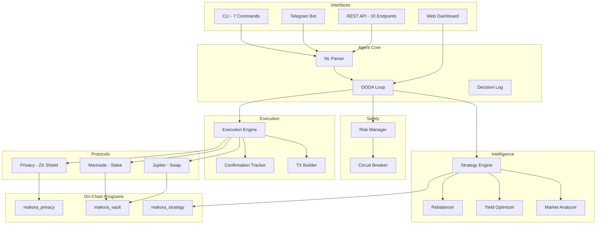

# Makora

**The First Privacy-Preserving DeFi Agent on Solana**

[-8b5cf6?style=flat-square)](https://claude.ai)
[](https://solana.com)
[](https://en.wikipedia.org/wiki/Zero-knowledge_proof)
[](LICENSE)

> All code in this repository was written by an AI agent (Claude) for the [Solana Agent Hackathon](https://colosseum.com/agent-hackathon). Every line of TypeScript, Rust, and Circom.

---

## What Makes Makora Different

Makora is not a trading bot. It's an **autonomous DeFi agent** that thinks, adapts, and protects your privacy on Solana.

| Feature | Makora | Typical DeFi Bots |
|---------|--------|-------------------|
| On-chain programs | 3 Anchor programs | 0 (API-only) |
| Zero-knowledge privacy | Stealth addresses + shielded transfers | None |
| Decision framework | OODA loop (Observe-Orient-Decide-Act) | Simple rules |
| Risk management | Circuit breaker + absolute VETO | Basic limits |
| Solana-native | 100% | Often EVM-first |
| Agent-to-Agent API | REST API for composability | None |
| NL interface | Parse natural language commands | Commands only |
| Interfaces | CLI + Dashboard + Telegram + REST API | Single interface |

---

## What It Does

```
You: "swap 10 SOL to USDC"

Makora:
  1. OBSERVE  - Fetches Jupiter quote, checks 20+ DEX routes
  2. ORIENT   - Analyzes price impact, slippage, market conditions
  3. DECIDE   - Strategy engine evaluates, risk manager approves
  4. ACT      - Executes on-chain via versioned transaction

  Result: TX confirmed at slot 312,847,291
  Explorer: https://explorer.solana.com/tx/5K2x...
```

### DeFi Operations
- **Swaps** via Jupiter (real aggregation across Raydium, Orca, Lifinity, Meteora, Phoenix)
- **Staking** via Marinade (SOL -> mSOL liquid staking, ~7.2% APY)
- **Privacy** via ZK proofs (stealth addresses + shielded transfers)

### Operating Modes
- **Advisory** -- Makora suggests, you approve
- **Autonomous** -- Makora executes within risk limits (circuit breaker protected)

---

## Architecture



### The OODA Loop (The Wheel)

```
     ╔═══════════╗
     ║  OBSERVE  ║  Fetch portfolio, prices, yields
     ╠═══════════╣
     ║  ORIENT   ║  Classify market: volatility, trend, regime
     ╠═══════════╣
     ║  DECIDE   ║  Strategy evaluation + risk validation
     ╠═══════════╣
     ║    ACT    ║  Execute with simulation, retry, confirmation
     ╚═══════════╝
         ↻ repeat every 30 seconds (auto mode)
```

---

## Quick Start

```bash
# Prerequisites: Node.js 20+, pnpm 8+

# Clone
git clone https://github.com/IsSlashy/Makora.git
cd Makora

# Install
pnpm install

# Build all packages
pnpm build

# Set up wallet (if you don't have one)
solana-keygen new

# Run CLI
cd apps/cli && node dist/index.js status

# Start API server
cd apps/api && node dist/index.js

# Start Telegram bot (requires TELEGRAM_BOT_TOKEN in .env)
cd apps/telegram && node dist/index.js
```

### Environment Variables

```bash
# .env file
SOLANA_NETWORK=devnet
SOLANA_RPC_URL=https://api.devnet.solana.com
HELIUS_API_KEY=your_helius_key          # Optional: faster RPC
WALLET_PATH=~/.config/solana/id.json
TELEGRAM_BOT_TOKEN=your_telegram_token  # For Telegram bot
PORT=8080                               # For API server
```

---

## CLI Commands

All commands execute **real transactions** on Solana devnet/mainnet via live protocol adapters.

```bash
# Portfolio overview with real on-chain data
makora status

# Swap via Jupiter aggregator (real quote + execution)
makora swap 0.1 SOL USDC

# Stake via Marinade Finance (real mSOL conversion)
makora stake 1.0

# Strategy evaluation with live portfolio analysis
makora strategy

# Run single OODA cycle
makora auto cycle

# Enable autonomous mode
makora auto on

# Shield SOL into privacy pool (ZK proof)
makora shield 1.0

# Natural language command
makora agent "swap half my SOL to USDC"
```

---

## Telegram Bot

```
/start     - Welcome and command list
/status    - Real-time portfolio
/swap 10 SOL USDC - Jupiter quote
/stake 5   - Marinade staking quote
/strategy  - Strategy evaluation
/auto cycle - Run OODA cycle
/shield 1  - Privacy shield info
/health    - Agent health check

Or natural language: "what should I do with my portfolio?"
```

---

## REST API (Agent-to-Agent)

Makora exposes a REST API so other agents can compose on top of it.

```bash
# Health check
GET /api/health

# Read any wallet's portfolio
GET /api/portfolio/:wallet

# Jupiter swap quote
GET /api/quote/swap?from=SOL&to=USDC&amount=10

# Marinade stake quote
GET /api/quote/stake?amount=5

# Strategy evaluation for any wallet
GET /api/strategy/evaluate/:wallet

# Risk assessment
GET /api/risk/check

# Generate stealth address (ZK privacy)
POST /api/privacy/stealth-address

# Agent OODA status
GET /api/agent/status

# Run single OODA cycle
POST /api/agent/cycle

# Natural language command
POST /api/agent/command  { "command": "swap 10 SOL to USDC" }
```

---

## Monorepo Structure

```
makora/
├── packages/
│   ├── types/              # Shared type definitions
│   ├── data-feed/          # Portfolio reader, Jupiter prices, RPC
│   ├── protocol-router/    # Multi-protocol routing + adapter registry
│   ├── execution-engine/   # TX build → simulate → risk check → send → confirm → retry
│   ├── risk-manager/       # VETO power + circuit breaker + daily loss tracking
│   ├── strategy-engine/    # Market analyzer + yield optimizer + rebalancer
│   ├── agent-core/         # OODA loop + NL parser + decision log
│   ├── privacy/            # Stealth addresses + shielded transfers + Merkle tree + ZK prover
│   └── adapters/
│       ├── jupiter/        # DEX aggregator (real @jup-ag/api)
│       ├── marinade/       # Liquid staking (real @marinade.finance/marinade-ts-sdk)
│       ├── raydium/        # AMM / CLMM
│       ├── kamino/         # Vault strategies
│       └── privacy/        # Shield / unshield via makora_privacy program
├── apps/
│   ├── cli/                # Terminal interface (7 commands, real execution)
│   ├── dashboard/          # Next.js web UI with The Wheel visualization
│   ├── telegram/           # Telegram bot (grammy)
│   └── api/                # REST API (Express, 10 endpoints)
├── programs/
│   ├── makora_vault/       # Anchor — portfolio vaults
│   ├── makora_strategy/    # Anchor — strategy + audit trail
│   └── makora_privacy/     # Anchor — stealth + shielded pool + nullifiers
├── circuits/
│   ├── transfer.circom     # Shielded transfer proof
│   ├── merkle.circom       # Merkle inclusion proof
│   └── poseidon.circom     # Poseidon hash (ZK-friendly)
└── tests/
    └── integration.test.ts # End-to-end integration tests
```

**21 packages** | **3 Solana programs** | **3 ZK circuits** | **4 apps** | **~20,000 lines of code**

---

## Tech Stack

| Layer | Technology |
|-------|-----------|
| Blockchain | Solana (devnet + mainnet-beta) |
| Smart Contracts | Anchor 0.30.1 / Rust |
| ZK Proofs | Circom / Groth16 / snarkjs |
| DeFi Protocols | Jupiter v6, Marinade v5 |
| TypeScript | pnpm workspaces + Turborepo + tsup |
| CLI | Commander.js + chalk + ora |
| Dashboard | Next.js + Tailwind CSS |
| Telegram | grammy |
| API | Express + CORS |
| Wallet | Solana Wallet Adapter |
| Tests | Vitest |

---

## Privacy Layer

### Stealth Addresses

Generate one-time addresses for receiving payments. The sender creates a fresh address from the recipient's stealth meta-address; only the recipient can detect and spend from it.

```
Sender → generateStealthAddress(recipientMeta)
       → derives one-time PublicKey + ephemeral key
       → sends SOL to one-time address
       → only recipient can scan and claim
```

### Shielded Transfers

Deposit SOL into a shielded pool using ZK proofs. Withdraw to any address without linking sender and receiver.

```
Shield:   commitment = Poseidon(secret, amount)
          Merkle tree insert → on-chain pool deposit
Unshield: Generate Groth16 proof of commitment knowledge
          Verify on-chain → withdraw without linkage
```

---

## Solana Programs (Deployed to Devnet)

| Program | Program ID | Size | Purpose |
|---------|-----------|------|---------|
| `makora_vault` | `BTAd1ghiv4jKd4kREh14jCtHrVG6zDFNgLRNoF9pUgqw` | 246KB | Portfolio vaults with deposit/withdraw/position tracking |
| `makora_strategy` | `EH5sixTHAoLsdFox1bR3YUqgwf5VuX2BdXFew5wTE6dj` | 295KB | Strategy config + on-chain audit trail (ring buffer, 8 entries) |
| `makora_privacy` | `C1qXFsB6oJgZLQnXwRi9mwrm3QshKMU8kGGUZTAa9xcM` | 298KB | Stealth registry + shielded pool + nullifier double-spend prevention |

Verify on devnet:
```bash
solana program show BTAd1ghiv4jKd4kREh14jCtHrVG6zDFNgLRNoF9pUgqw --url devnet
solana program show EH5sixTHAoLsdFox1bR3YUqgwf5VuX2BdXFew5wTE6dj --url devnet
solana program show C1qXFsB6oJgZLQnXwRi9mwrm3QshKMU8kGGUZTAa9xcM --url devnet
```

---

## Risk Management

The risk manager has **absolute VETO power** over every agent action.

| Control | Default |
|---------|---------|
| Max position size | 25% of portfolio |
| Max slippage | 1% (100 bps) |
| Max daily loss | 5% (circuit breaker) |
| Min SOL reserve | 0.05 SOL (always keep gas) |
| Max protocol exposure | 50% per protocol |

If any check fails, the transaction is **blocked** -- even in autonomous mode.

---

## How It Was Built

This entire project was built autonomously by Claude (Anthropic) for the [Solana Agent Hackathon](https://colosseum.com/agent-hackathon).

**7 development phases, each executed by AI:**

1. Foundation -- Monorepo, types, data feed, Jupiter adapter, vault program, CLI
2. Core DeFi -- Marinade/Raydium/Kamino adapters, protocol router, execution engine, risk manager
3. Agent Intelligence -- Strategy engine (3 strategies), OODA loop, NL parser, strategy program
4. Privacy Layer -- ZK circuits (Circom), stealth addresses, shielded transfers, privacy program
5. CLI + Dashboard -- 7 CLI commands, Next.js dashboard with The Wheel visualization
6. Telegram + API -- Telegram bot, REST API (10 endpoints), agent-to-agent composability
7. Integration -- End-to-end tests, real devnet execution, README

Every line of TypeScript, Rust, and Circom was written by Claude. No human-written code.

---

## License

MIT

---

*Built for the [Solana Agent Hackathon](https://colosseum.com/agent-hackathon) by [Volta Team](https://github.com/IsSlashy)*
